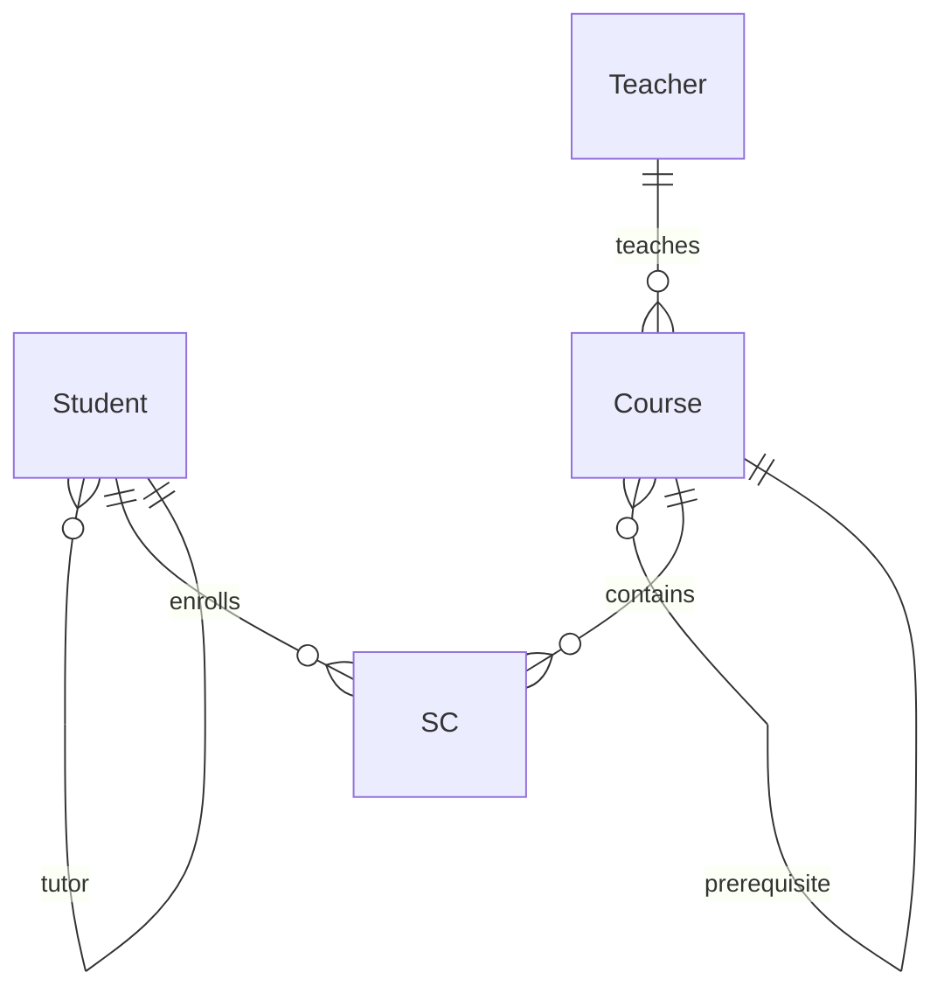

# 《数据库原理》课程实验报告

| 项目 | 内容 |
| ---- | ---- |
| 姓名 | ________ |
| 学号 | ________ |
| 班级 | ________ |
| 指导老师 | ________ |
| 实验日期 | ________ |
| 提交日期 | ________ |

---

## 一、实验目的

通过对 MySQL 8.x 数据库管理系统的实操，熟悉关系数据库的建立、数据定义、数据查询、数据更新、视图、权限管理、完整性约束、触发器以及数据库备份与恢复等内容，加深对课堂讲授的关系数据库原理的理解，提高独立使用 SQL 解决实际问题的能力。

## 二、实验环境

- 操作系统：Windows 10/11
- 数据库管理系统：MySQL 8.0.x（`SELECT VERSION();` 查询显示版本号）
- 客户端：MySQL Workbench / Navicat / 命令行 `mysql`
- 字符集：utf8mb4

## 三、数据库设计

### 3.1 场景描述

模拟一所大学的"学生-教师-课程-选课"信息管理系统（简称 SCS）。系统维护：

- **学生**（Student）：可有高年级学生担任导师（Tutor_Sno 自引用）；
- **教师**（Teacher）：每位教师可讲授多门课程；
- **课程**（Course）：课程之间存在先修关系（Cpno 自引用），每门课由一位教师讲授；
- **选课**（SC）：记录学生选课及成绩。

### 3.2 E-R 图



### 3.3 关系模式

- `Student (Sno, Sname, Ssex, Sage, Sdept, Tutor_Sno)`，主键 `Sno`，`Tutor_Sno` 自引用外键；
- `Teacher (Tno, Tname, Ttitle, Tdept)`，主键 `Tno`；
- `Course (Cno, Cname, Cpno, Ccredit, Tno)`，主键 `Cno`，`Cpno` 自引用，`Tno` 外键；
- `SC (Sno, Cno, Grade)`，联合主键 `(Sno, Cno)`，`Sno` / `Cno` 外键。

完整性约束：主键、外键、`NOT NULL`、`UNIQUE`、`CHECK`（详见 `sql/01_schema.sql`）。

## 四、实验步骤与结果

> 每小节均先给出实验目的、对应脚本，再留"截图此处"用于粘贴实际运行结果。

### 4.1 关系数据库系统环境建立

使用 `CREATE DATABASE scs ...` 创建数据库，然后 `USE scs;` 切换。

执行：

```sql
SOURCE sql/01_schema.sql;
```

**截图此处：** 运行 `SHOW TABLES;` 的结果（应显示 4 张表）。

---

### 4.2 数据定义

#### 4.2.1 建立 3 个及以上关系表

见 `sql/01_schema.sql`，共建立 4 张表。

**截图此处：** 每张表 `DESC <表名>;` 的结果。

#### 4.2.2 修改基本表的结构

见 `sql/02_alter_drop.sql`。

**截图此处：** ALTER 前后 `DESC Student;` 对比截图。

#### 4.2.3 删除基本表

同一脚本末尾示例 `DROP TABLE TempDemo;`。

**截图此处：** 删除前后 `SHOW TABLES;` 对比。

---

### 4.3 数据查询

见 `sql/04_queries.sql`。依次执行并记录：

| 编号 | 查询类型 | 查询目的 |
| ---- | -------- | -------- |
| A1-A4 | 单表查询 | 基于 Student 的选择 / 模糊匹配 / DISTINCT / IS NULL |
| B1-B3 | 分组统计 | 不带 / 带 HAVING 的 GROUP BY |
| C1-C3 | 单表自身连接 | Student-Tutor、Course-Cpno 自身连接 |
| D1-D2 | 多表连接 | 四表连接、特定教师课程学生名单 |
| E1-E8 | 嵌套查询 | IN / = / EXISTS / NOT EXISTS / ANY / ALL / NOT IN |
| F1-F4 | 集合查询 | UNION / UNION ALL / INTERSECT / EXCEPT |

**截图此处：** 每类查询至少留 1 张截图；重点是 E4（关系除法）和 F3/F4（集合查询）。

---

### 4.4 数据更新

见 `sql/05_updates.sql`。

**截图此处：** 插入、删除、修改前后数据对比截图。

---

### 4.5 视图

见 `sql/06_views.sql`。

重点演示：
- 列名省略 / 显式指定；
- 通过视图 UPDATE 基表；
- 不可更新视图（带聚合）；
- `WITH CHECK OPTION`。

**截图此处：** 分别给出可更新视图的 UPDATE 成功截图、不可更新视图的报错截图、带 CHECK OPTION 拒绝修改的截图。

---

### 4.6 权限管理

见 `sql/07_privileges.sql`。

**截图此处：** 分别以 `u_student` / `u_teacher` / `u_admin` 登录 MySQL，执行 SELECT / UPDATE / GRANT 的截图，以及收回权限后无权操作的报错截图。

---

### 4.7 三类完整性约束

见 `sql/01_schema.sql`（建表时）和 `sql/08_constraints.sql`（建表后）。

**截图此处：**

- 违反主键约束的插入报错；
- 违反 CHECK 约束的插入报错；
- 违反外键的插入或删除报错；
- `information_schema.TABLE_CONSTRAINTS` 查询结果。

---

### 4.8 触发器

见 `sql/09_triggers.sql`。

**截图此处：**

- `SHOW TRIGGERS FROM scs;` 结果；
- 插入成绩为 120 被截断为 100 的对比；
- AFTER DELETE 触发器向 `SC_DeleteLog` 写入日志的结果。

---

### 4.9 数据库备份与恢复（选做）

见 `sql/10_backup_restore.md` 的命令说明；备份文件位于 `backup/scs_backup.sql`。

**截图此处：**

- 执行 `mysqldump` 的命令及输出；
- `DROP DATABASE scs;` 后的 `SHOW DATABASES;`；
- 恢复完成后再次 `SHOW DATABASES;` 和各表行数统计。

---

## 五、实验结论

通过本次实验，系统性完成了：

1. 数据定义（DDL）：建库、建表、修改和删除表结构，同时体会了三类完整性约束是如何在建表时被声明的；
2. 数据操纵（DML）：掌握了各种形态的 SELECT（单表、连接、嵌套、集合）以及 INSERT/UPDATE/DELETE；
3. 视图：理解视图的"虚表"本质，验证了视图可更新性的约束条件；
4. 权限与安全：使用 MySQL 8 的角色机制实现分级授权，掌握 GRANT / REVOKE / WITH GRANT OPTION 的用法；
5. 完整性：通过违反约束的测试用例观察到 DBMS 对数据完整性的自动维护；
6. 触发器：利用 BEFORE/AFTER 触发器实现业务规则自动化；
7. 备份与恢复：能够使用 `mysqldump` 完成逻辑备份与恢复。

## 六、存在的问题与解决办法

> 以下是常见问题清单，同学可根据自己的实际情况保留 / 修改 / 补充。

1. **中文乱码**：建库时显式指定 `utf8mb4`，并在客户端设置 `SET NAMES utf8mb4;`。
2. **GROUP BY 报错 `ONLY_FULL_GROUP_BY`**：MySQL 8 默认 `sql_mode` 含该值。保证非聚合列都在 `GROUP BY` 中，或使用 `ANY_VALUE()`。
3. **DELETE 的子查询不能引用被删表**：MySQL 要求在子查询外包一层派生表绕过，见 `05_updates.sql` 的 B2。
4. **角色未默认激活**：登录后需 `SET ROLE ALL;` 或事先 `SET DEFAULT ROLE ALL TO <user>;`。
5. **DROP TABLE 后视图失效**：MySQL 不会级联删除视图，只能手动 `DROP VIEW`。

## 七、感想

> 写在此处（例如：对关系模型强大之处的感受；对 DBMS 在完整性、并发、事务、安全等方面的"免费午餐"的体会；以及遇到的困难与收获。）

---

## 八、附件清单

- `sql/01_schema.sql` ~ `sql/09_triggers.sql`：分节 SQL 脚本；
- `sql/10_backup_restore.md`：备份恢复说明；
- `backup/scs_backup.sql`：`mysqldump` 产出的备份文件；
- `docs/验证问题回答.md`：实验指导书第三部分 1~8 问题的逐条作答。
