# 《数据库原理》课程实验报告

| 项目 | 内容 |
| ---- | ---- |
| 姓名 | 霍一韩|
| 学号 | 1120240600 |
| 班级 | 07182401 |
| 指导老师 | 颜珂 |
| 实验日期 | 2026/4 |
| 提交日期 | 2026/4 |

---

## 一、实验目的

通过对 MySQL 8.x 数据库管理系统的实操，熟悉关系数据库的建立、数据定义、数据查询、数据更新、视图、权限管理、完整性约束、触发器以及数据库备份与恢复等内容，加深对课堂讲授的关系数据库原理的理解，提高独立使用 SQL 解决实际问题的能力。

## 二、实验环境

- 操作系统：Windows 10/11
- 数据库管理系统：MySQL 8.0.x（`SELECT VERSION();` 查询显示版本号）
- 客户端：MySQL Workbench / Navicat / 命令行 `mysql`
- 字符集：utf8mb4

## 三、数据库设计

### 3.1 场景描述

模拟一所大学的"学生-教师-课程-选课"信息管理系统（简称 SCS）。系统维护：

- **学生**（Student）：可有高年级学生担任导师（Tutor_Sno 自引用）；
- **教师**（Teacher）：每位教师可讲授多门课程；
- **课程**（Course）：课程之间存在先修关系（Cpno 自引用），每门课由一位教师讲授；
- **选课**（SC）：记录学生选课及成绩。

### 3.2 E-R 图

为减少连线交叉、版面更清晰，将**教师—课程—选课**主结构与**学生导师 / 课程先修**两处自关联分开展示（语义与上一版一致）。

**（1）教师、课程、学生与选课**

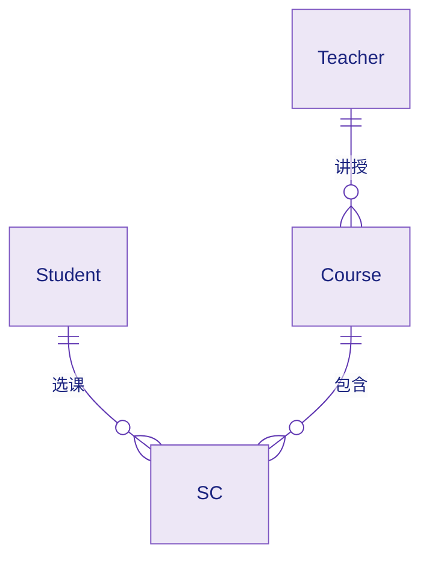
```mermaid
%%{init: {'theme':'base','themeVariables':{
  'primaryColor':'#ede7f6',
  'primaryTextColor':'#1a237e',
  'primaryBorderColor':'#7e57c2',
  'lineColor':'#5e35b1',
  'secondaryColor':'#f3e5f5',
  'tertiaryColor':'#fafafa'
}}}%%
erDiagram
    Teacher ||--o{ Course : "讲授"
    Student ||--o{ SC : "选课"
    Course ||--o{ SC : "包含"
```

**（2）自关联：导师与先修课**

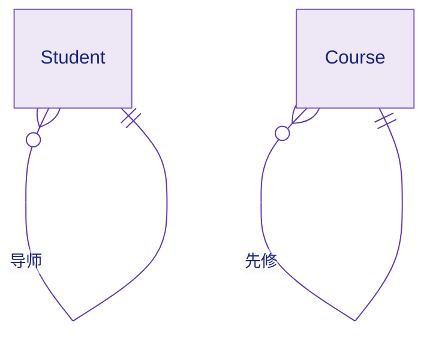
```mermaid
%%{init: {'theme':'base','themeVariables':{
  'primaryColor':'#ede7f6',
  'primaryTextColor':'#1a237e',
  'primaryBorderColor':'#7e57c2',
  'lineColor':'#5e35b1',
  'secondaryColor':'#f3e5f5',
  'tertiaryColor':'#fafafa'
}}}%%
erDiagram
    Student }o--|| Student : "导师"
    Course }o--|| Course : "先修"
```

### 3.3 关系模式

- `Student (Sno, Sname, Ssex, Sage, Sdept, Tutor_Sno)`，主键 `Sno`，`Tutor_Sno` 自引用外键；
- `Teacher (Tno, Tname, Ttitle, Tdept)`，主键 `Tno`；
- `Course (Cno, Cname, Cpno, Ccredit, Tno)`，主键 `Cno`，`Cpno` 自引用，`Tno` 外键；
- `SC (Sno, Cno, Grade)`，联合主键 `(Sno, Cno)`，`Sno` / `Cno` 外键。

完整性约束：主键、外键、`NOT NULL`、`UNIQUE`、`CHECK`（详见 `sql/01_schema.sql`）。

## 四、实验步骤与结果

> 每小节均先说明实验目的及对应脚本，再配以实际运行截图（见 `docs/images/` 目录，编号 1–26）。

### 4.1 关系数据库系统环境建立

使用 `CREATE DATABASE scs ...` 创建数据库，然后 `USE scs;` 切换。

执行：

```sql
SOURCE sql/01_schema.sql;
```

执行完 `01_schema.sql` 后使用 `USE scs; SHOW TABLES;` 查看库中已建成的 4 张关系表：

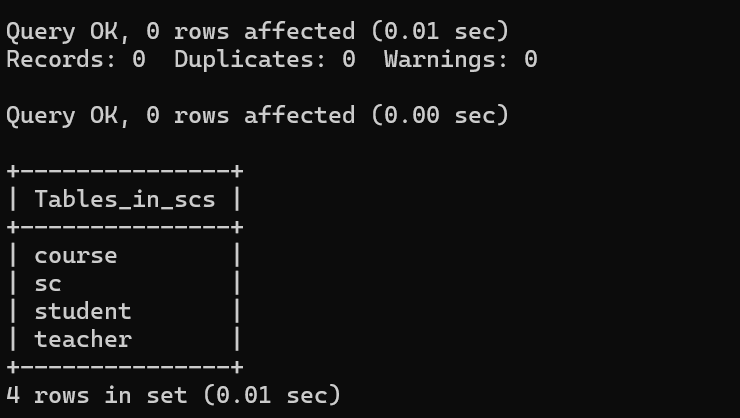

---

### 4.2 数据定义

#### 4.2.1 建立 3 个及以上关系表

见 `sql/01_schema.sql`，共建立 4 张表。分别执行 `DESC Student; DESC Teacher; DESC Course; DESC SC;` 查看结构：

- `Student` 含 6 列，主键 `Sno`，`(Sname,Sdept)` 联合唯一，`Ssex` 为 `ENUM('M','F')`，`Tutor_Sno` 自引用外键。

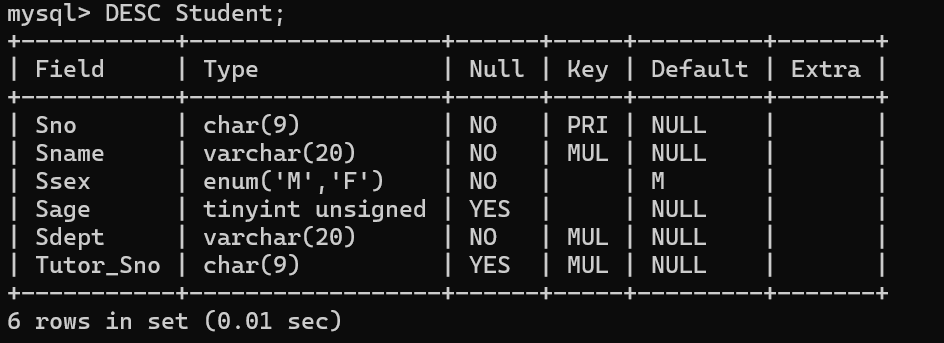

- `Teacher` 含 4 列，主键 `Tno`，`Ttitle` 为 `ENUM('TA','LECTURER','ASSOC_PROF','PROF')`。

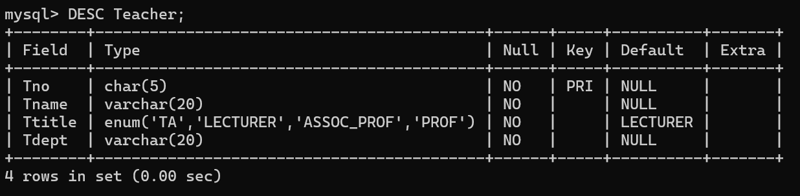

- `Course` 含 5 列，主键 `Cno`，`Cname` 唯一，`Cpno` / `Tno` 为外键。

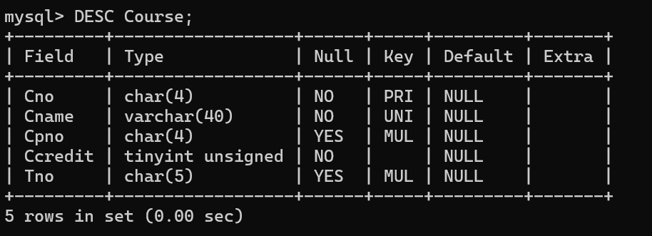

- `SC` 含 3 列，`(Sno,Cno)` 联合主键，`Grade` 为 `DECIMAL(5,2)`。

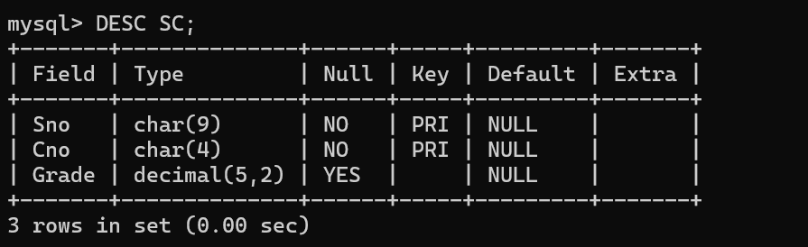

#### 4.2.2 修改基本表的结构

见 `sql/02_alter_drop.sql`。脚本依次演示 `ADD COLUMN / MODIFY COLUMN / RENAME COLUMN / ADD/DROP CONSTRAINT`，并在末尾把结构还原，便于与 4.2.1 做"前—改—还原"对比。

执行脚本后再次 `DESC` 四张表，结构已恢复到最初定义（证明整套 ALTER 语句语法正确）：

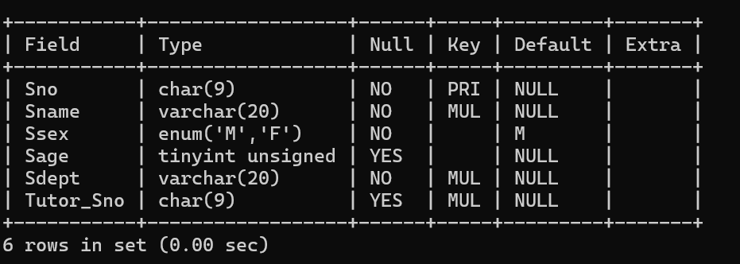

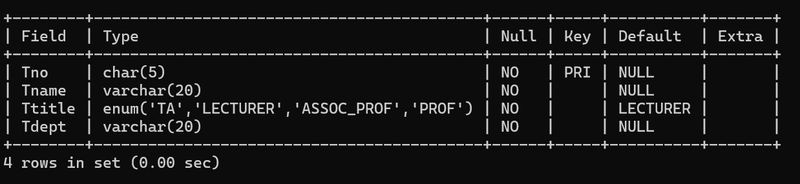

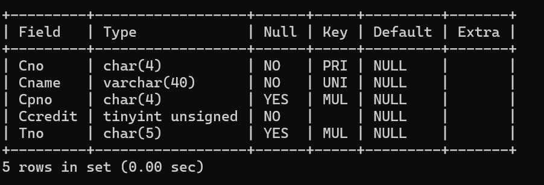

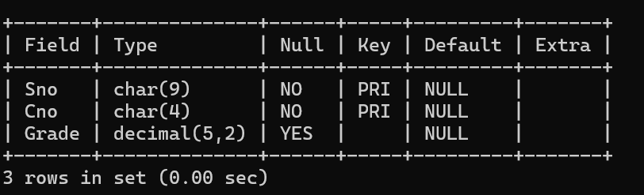

#### 4.2.3 删除基本表

同一脚本末尾示例 `CREATE TABLE TempDemo ...` 再 `DROP TABLE TempDemo`。截图中依次可见：原本 4 张表 → 建完临时表变成 5 张 → `DROP TABLE` 后又回到 4 张，验证了建/删基本表的正确性。

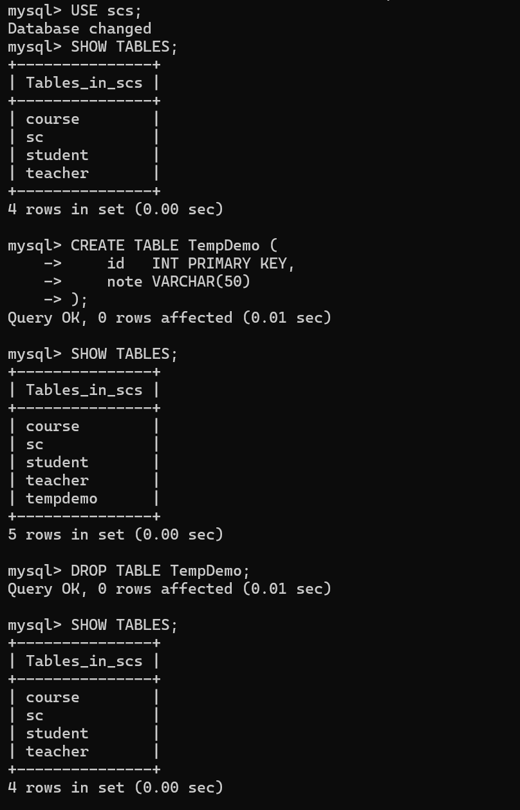

---

### 4.3 数据查询

见 `sql/04_queries.sql`。依次执行并记录：

| 编号 | 查询类型 | 查询目的 |
| ---- | -------- | -------- |
| A1-A4 | 单表查询 | 基于 Student 的选择 / 模糊匹配 / DISTINCT / IS NULL |
| B1-B3 | 分组统计 | 不带 / 带 HAVING 的 GROUP BY |
| C1-C3 | 单表自身连接 | Student-Tutor、Course-Cpno 自身连接 |
| D1-D2 | 多表连接 | 四表连接、特定教师课程学生名单 |
| E1-E8 | 嵌套查询 | IN / = / EXISTS / NOT EXISTS / ANY / ALL / NOT IN |
| F1-F4 | 集合查询 | UNION / UNION ALL / INTERSECT / EXCEPT |

下面按类别给出代表性结果截图。

**A 单表查询 + B1 按院系分组统计：** 先按条件查出姓王的 CS 学生、`LIKE` 模糊查询、`DISTINCT` 去重得到院系列表、`IS NULL` 找导师空缺的学生；随后 `GROUP BY Sdept` 得到各院系人数和平均年龄（CS 4 人、IS 3 人、MA 3 人、EE 2 人）。

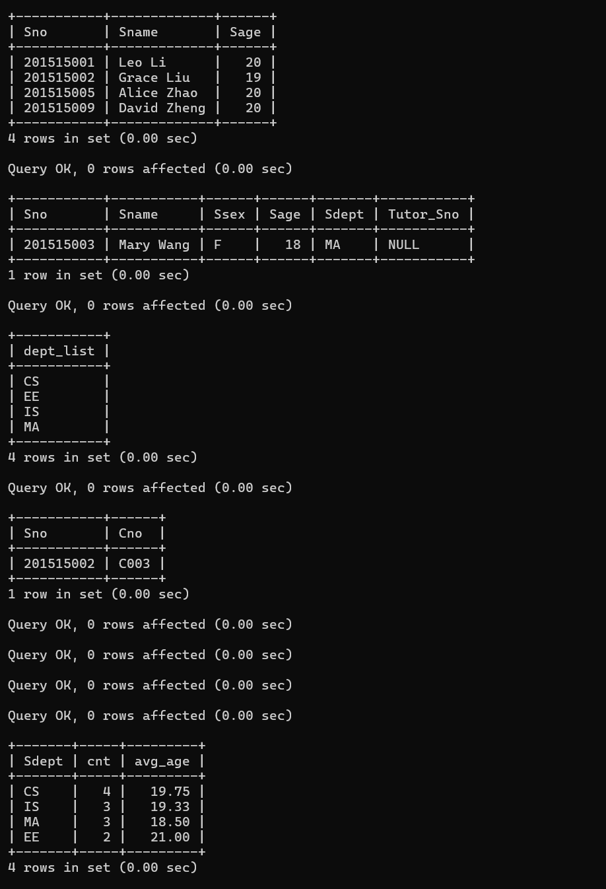

**B2–B3 分组 + C1 自身连接：** `GROUP BY Cno HAVING COUNT(*)>=2` 得到每门课选课人数、最高/最低/平均分；`GROUP BY Sno` + `HAVING` 找出修满 3 门的学生；C1 使用 `Student` 的自连接，依次列出每个学生的导师学号与姓名。

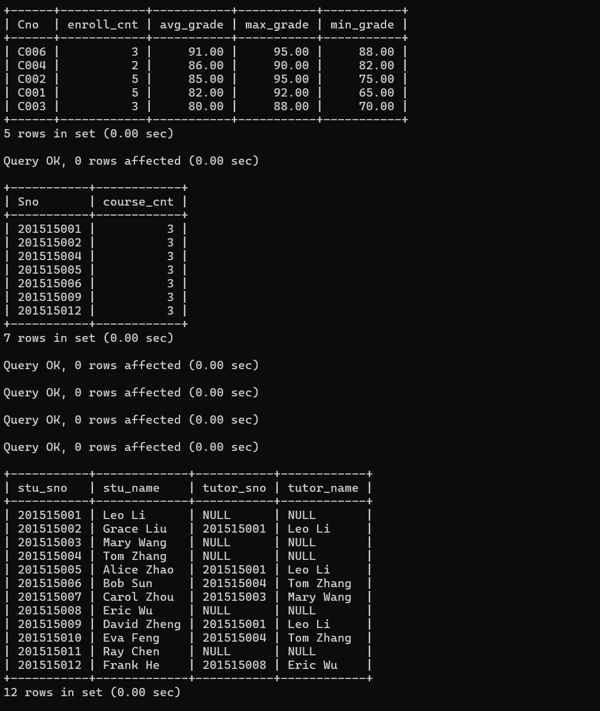

**C3 课程先修关系 + D1/D2 多表连接：** `Course` 自连接显示每门课的先修课名称（例如 `Database` 的先修课是 `Data Structures`）；`Student ⋈ SC ⋈ Course ⋈ Teacher` 四表连接返回 31 条完整选课明细；最后过滤 `Tname='Wang Wei'` 得到"王伟"讲授的 11 条课程选修信息。

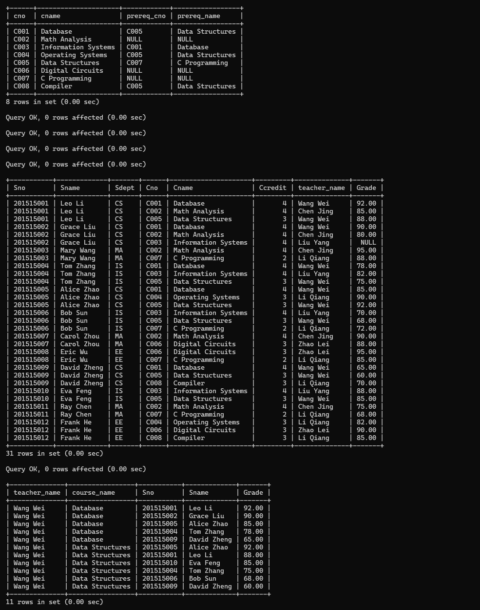

**E1–E2 IN / 标量子查询：** E1 用 `IN` 子查询找"选修了 C001 的学生"；E2 用标量子查询把这个需求改写为"与李勇同院系的学生"，对比了两种子查询的写法与结果。

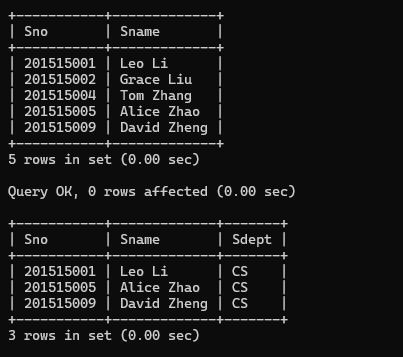

**E3–E7 EXISTS/ANY/ALL 等嵌套：** 包括 `EXISTS` 查出至少选了一门课的学生、`NOT EXISTS` + 双重否定实现"选修了全部课程"（关系除法，结果为空是正常的，说明没有学生修完全部 8 门）、`ANY`、`ALL` 等谓词。

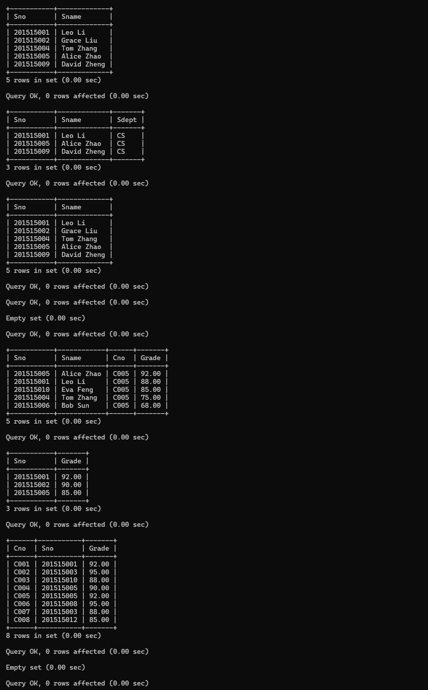

**F 集合查询：** `UNION` 去重合并两类学生、`UNION ALL` 保留重复（9 行）、`INTERSECT`（交集得到 4 行）以及用 `NOT IN` 模拟 `EXCEPT`。MySQL 8 中 `INTERSECT/EXCEPT` 从 8.0.31 起支持，低版本环境下需改用 `IN/NOT IN` 或 `JOIN` 模拟。

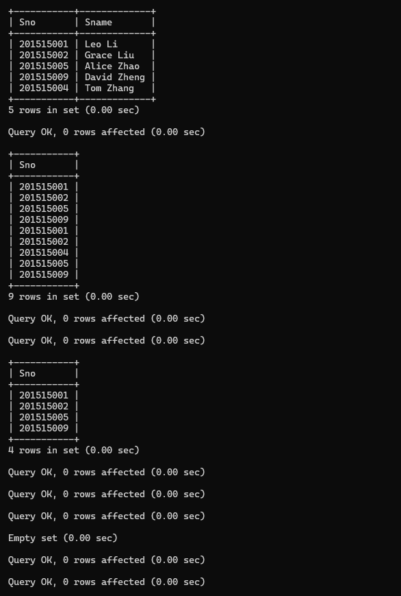

---

### 4.4 数据更新

见 `sql/05_updates.sql`。为了方便回滚，整个脚本以 `START TRANSACTION; ... ROLLBACK;` 包裹，不会污染已有数据。

**A 插入：** 演示完整元组插入、缺省列插入（`Jia Sun` 的 `Sage` 为 `NULL`）、以及 `INSERT ... SELECT` 从查询结果批量插入；之后按院系统计人数，可看到 CS 由 4 增加为 5、IS 由 3 增加为 4。

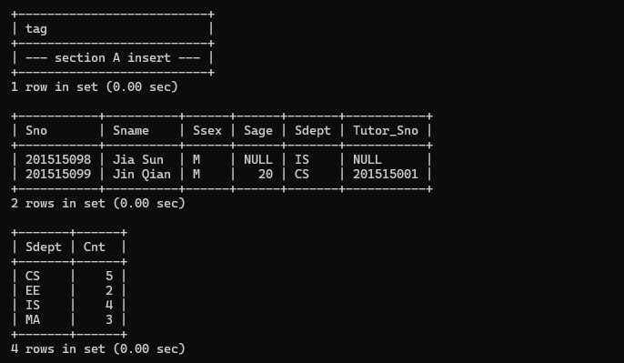

**B 删除：** 先直接 `DELETE` 指定学生，再用带子查询的 `DELETE` 清除"欠学分/成绩不及格"相关记录，最后重新 `GROUP BY Sno` 统计剩余选课数，每人最多 3 条。

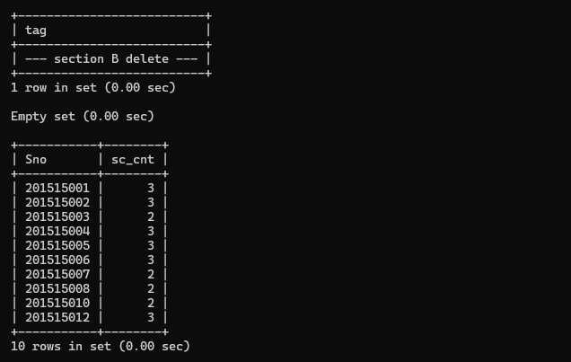

**C 修改：** 对 `Grace Liu` 年龄 +1、把选了 Database 课的学生统一加 5 分（因封顶触发器 100 分限制，`Leo Li 97`、`Grace Liu 95` 等），并将 `Wang Wei` 的职称改为 `PROF`。

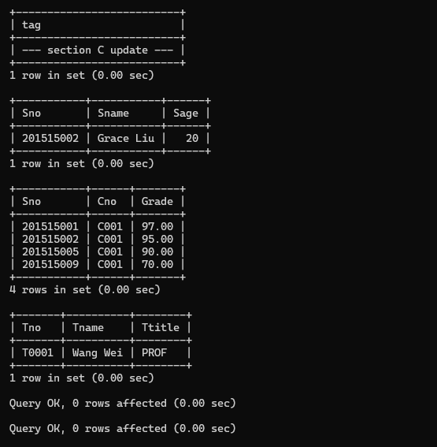

---

### 4.5 视图

见 `sql/06_views.sql`。

重点演示：
- 列名省略 / 显式指定；
- 通过视图 UPDATE 基表；
- 不可更新视图（带聚合）；
- `WITH CHECK OPTION`。

**B 视图查询（读）：** 截图中依次展示：
- `V_IS_Student`（IS 系学生视图）；
- `V_IS_Student_Check`（带 `WITH CHECK OPTION`）插入一条 IS 系学生 `Hui Zhou` 成功；
- `V_Student_AvgGrade`（含聚合，不可更新）列出 14 位学生的选课门数与均分；
- `V_SC_Detail`（三表连接视图）。

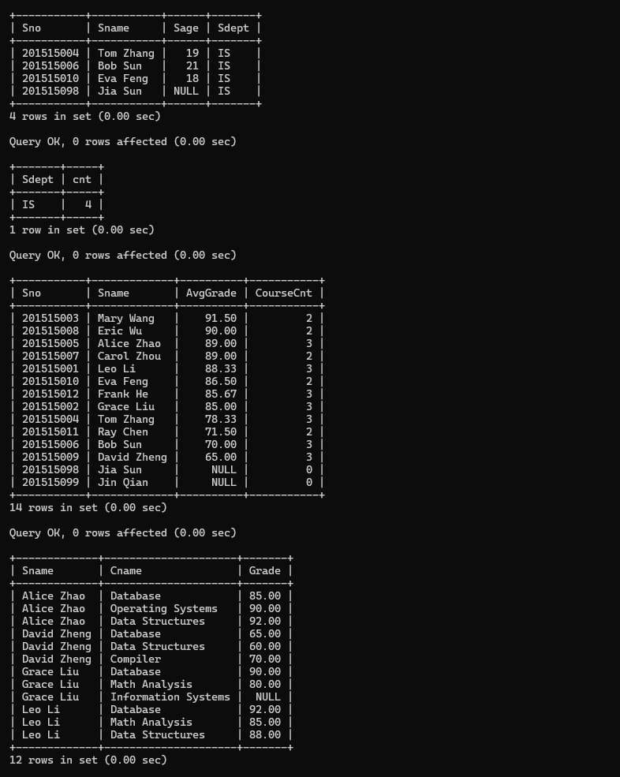

**C 视图更新与限制：**
- 通过可更新视图 `V_IS_Student` 把 `Tom Zhang` 年龄从 19 改为 20，UPDATE 成功；
- 对含聚合的视图 `V_Student_AvgGrade` 执行 UPDATE → `ERROR 1288 (HY000): ... is not updatable`；
- 对带 `WITH CHECK OPTION` 的视图 `V_IS_Student_Check` 插入一条非 IS 系学生 → `ERROR 1369 (HY000): CHECK OPTION failed`；
- 插入合法 IS 系学生 `Jia Sun` 成功，视图中新增一行；再次尝试写入 CS 系学生被 `CHECK OPTION` 拒绝。

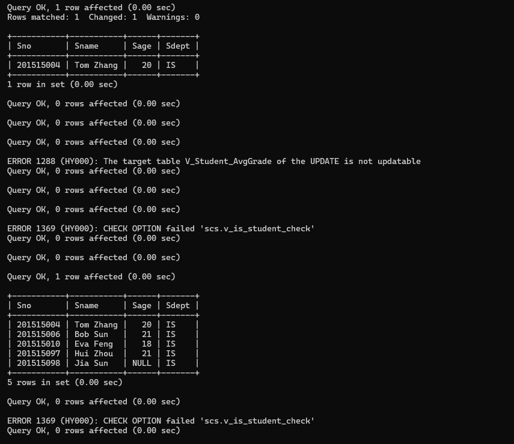

---

### 4.6 权限管理

见 `sql/07_privileges.sql`。

**u_student（只读角色 r_read_only）：** 登录后可以 `SELECT * FROM Student` 读取数据，但尝试 `UPDATE SC` 时返回 `ERROR 1142 (42000): UPDATE command denied`，说明只读权限生效。

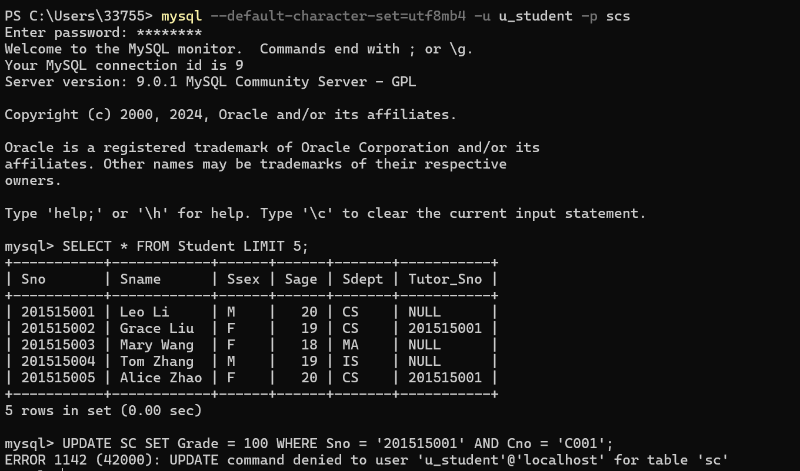

**u_teacher（成绩录入角色 r_grade_writer）：** 登录后可以读 `Student / Course`，并被允许 `UPDATE SC SET Grade=...`（列级授权只开放 `Grade` 列）；但尝试 `UPDATE Student SET Sage` 时同样返回 `ERROR 1142`，体现了"最小权限"原则。

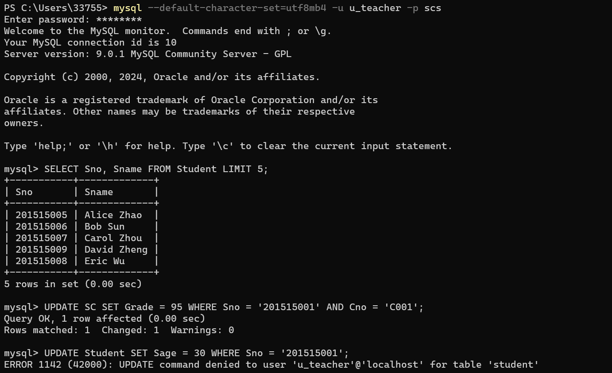

**u_admin（scs 库的 DBA，`WITH GRANT OPTION`）：** 登录后成功执行 `GRANT SELECT ON scs.Teacher TO 'u_student'@'localhost'`，说明其具备授权传递能力；这正是 `WITH GRANT OPTION` 的效果。

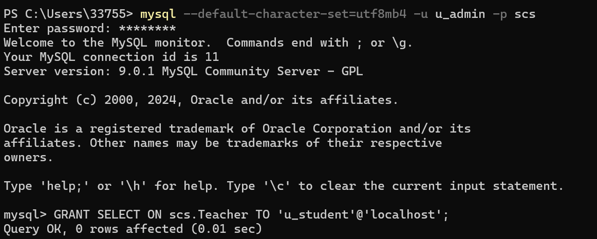

---

### 4.7 三类完整性约束

见 `sql/01_schema.sql`（建表时）和 `sql/08_constraints.sql`（建表后）。

下图汇总了 `08_constraints.sql` 中一组"故意违约"用例的报错信息，每条报错都印证了 DBMS 会主动维护相应的完整性：

- `ERROR 1062 Duplicate entry '201515001' for key 'student.PRIMARY'` —— **实体完整性**：主键重复被拒绝；
- `ERROR 1364 Field 'Sdept' doesn't have a default value` —— **域完整性/非空约束**：`NOT NULL` 列未给值；
- `ERROR 1265 Data truncated for column 'Ssex'` —— **域完整性**：`ENUM('M','F')` 限制了取值；
- `ERROR 1062 Duplicate entry 'Wang Wei' for key 'teacher.uk_teacher_name'` —— **唯一约束** `UNIQUE` 生效；
- `ERROR 1452 Cannot add or update a child row: foreign key constraint fails ... fk_sc_student` —— **参照完整性**：插入孤立子表记录被拒绝；
- `ERROR 1451 Cannot delete or update a parent row: foreign key constraint fails ... fk_sc_course` —— **参照完整性**：删除被引用的父表记录被拒绝。

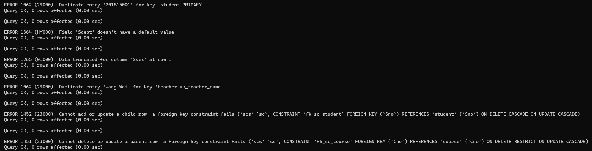

---

### 4.8 触发器

见 `sql/09_triggers.sql`。

截图按脚本顺序展示了三个关键环节：

1. `SHOW TRIGGERS FROM scs;` 列出 3 个触发器——`trg_sc_grade_clip_ins`（BEFORE INSERT 成绩封顶/置底）、`trg_sc_grade_clip_upd`（BEFORE UPDATE 同样封顶）、`trg_sc_log_delete`（AFTER DELETE 写日志）；
2. 往 `SC` 插入 `Grade=120` 后，查询得到的行 `Grade=100`，说明 BEFORE INSERT 触发器把超 100 的成绩截断；
3. 把 `Grade=-5` 更新为负分后，被 BEFORE UPDATE 触发器重写为 `0`；
4. 执行 `DELETE FROM SC WHERE ...` 后，`SC_DeleteLog` 中新增一条记录，字段包含被删记录的 `Sno / Cno / OldGrade / DeletedAt / OpUser`，验证 AFTER DELETE 的日志落地。

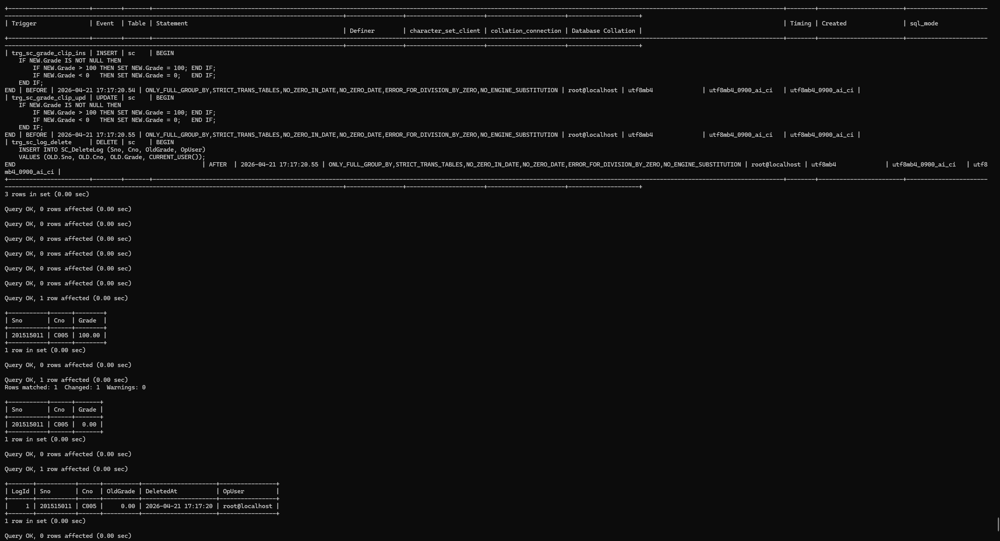

---

## 五、实验结论

通过本次实验，系统性完成了：

1. 数据定义（DDL）：建库、建表、修改和删除表结构，同时体会了三类完整性约束是如何在建表时被声明的；
2. 数据操纵（DML）：掌握了各种形态的 SELECT（单表、连接、嵌套、集合）以及 INSERT/UPDATE/DELETE；
3. 视图：理解视图的"虚表"本质，验证了视图可更新性的约束条件；
4. 权限与安全：使用 MySQL 8 的角色机制实现分级授权，掌握 GRANT / REVOKE / WITH GRANT OPTION 的用法；
5. 完整性：通过违反约束的测试用例观察到 DBMS 对数据完整性的自动维护；
6. 触发器：利用 BEFORE/AFTER 触发器实现业务规则自动化；
7. 备份与恢复：能够使用 `mysqldump` 完成逻辑备份与恢复。

## 六、存在的问题与解决办法

> 以下是常见问题清单，同学可根据自己的实际情况保留 / 修改 / 补充。

1. **中文乱码**：建库时显式指定 `utf8mb4`，并在客户端设置 `SET NAMES utf8mb4;`。
2. **GROUP BY 报错 `ONLY_FULL_GROUP_BY`**：MySQL 8 默认 `sql_mode` 含该值。保证非聚合列都在 `GROUP BY` 中，或使用 `ANY_VALUE()`。
3. **DELETE 的子查询不能引用被删表**：MySQL 要求在子查询外包一层派生表绕过，见 `05_updates.sql` 的 B2。
4. **角色未默认激活**：登录后需 `SET ROLE ALL;` 或事先 `SET DEFAULT ROLE ALL TO <user>;`。
5. **DROP TABLE 后视图失效**：MySQL 不会级联删除视图，只能手动 `DROP VIEW`。

## 七、感想

本次实验把课堂上的关系模型和 SQL 语法落到了具体操作上，从建表、查询、更新到视图、权限、约束和触发器，一步步走完一条完整的数据管理链路，比单纯看书印象深得多。动手过程中最直观的体会是：只要把主键、外键、非空、唯一等约束设计清楚，数据库就能在后台替你挡住大量错误数据；再配合触发器，一些业务规则（如成绩范围、删除留痕）可以自动执行，不必全靠应用层反复校验。

权限与角色部分让我认识到，数据库不仅是存数据的容器，也是安全边界——不同用户该看什么、能改什么，应当用 GRANT 明确下来，而不是所有人都用 root。实验中也遇到过环境类问题（例如 PowerShell 重定向、`mysql` 未加入 PATH、客户端字符集与脚本编码不一致等），排查过程虽然耗时，但反过来加深了对“工具链”和“连接参数”的理解。

整体而言，这次实验让我对 MySQL 的基本操作有了系统信心，也意识到规范设计与约束先行的重要性；后续若有机会，还想在更复杂的事务与并发场景里继续练习。

---

## 八、附件清单

- `sql/01_schema.sql` ~ `sql/09_triggers.sql`：分节 SQL 脚本；
- `sql/10_backup_restore.md`：备份恢复说明；
- `backup/scs_backup.sql`：`mysqldump` 产出的备份文件；
- `docs/验证问题回答.md`：实验指导书第三部分 1~8 问题的逐条作答。
